

  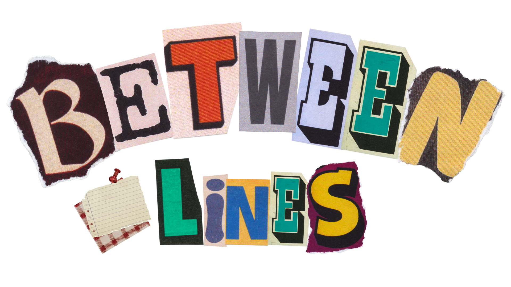
   
   

  # BETWEEN LINES

  **FOR THINGS WORTH SAYING**

   

  
  
  

   

  

    A modern, feature-rich platform for creating and exchanging digital letters with beautiful themes and a premium UI/UX experience.
  

## 📖 Project Overview

**Between Lines** is a digital sanctuary for thoughtful communication. In an era of instant messaging, it provides a space for deliberate, meaningful connection. Users can craft personalized digital letters, choosing from various envelope aesthetics and letter themes, and share them via unique links to create a memorable reading experience for the recipient.

## ✨ Features

- **🎨 Customizable Themes**
  - **Envelopes**: Choose from Red, Pink, Green, and Blue styles.
  - **Stationery**: Write on Sticky Notes, Lined Paper, Pastel sheets, or Minimalist cards.
  
- **🎵 Atmospheric Experience**
  - **Spotify Integration**: Attach a song to your letter to set the mood for the reader.
  - **Immersive UI**: Enjoy smooth animations for opening envelopes, unfolding letters, and page navigation.

- **🔗 Seamless Sharing**
  - Generate unique, secure links for your recipients.
  - **Rich Link Previews**: Optimized with Server-Side Rendering (SSR) to display beautiful Open Graph previews when shared on platforms like Discord, Messenger, or Twitter.

## 🏗️ Architecture

The application is built for performance and user experience using a modern serverless architecture:

- **Frontend**: Built with **SvelteKit** (Svelte 5), leveraging its powerful component system and transitions.
- **Rendering**: Hybrid approach using **SSR** (Server-Side Rendering) for dynamic meta tags and **CSR** (Client-Side Rendering) for the interactive letter experience.
- **Backend & Storage**: **Firebase** provides real-time database capabilities (Firestore) and secure file storage.
- **Deployment**: Optimized for serverless deployment (e.g., Vercel), ensuring low latency and high availability.

## 🛠️ Tech Stack

- **Framework**: [Svelte 5](https://svelte.dev/) & [SvelteKit](https://kit.svelte.dev/)
- **Build Tool**: [Vite 7](https://vitejs.dev/)
- **Styling**: Vanilla CSS & TailwindCSS
- **Database**: Firebase Firestore
- **Authentication/Storage**: Firebase SDK

---

## 📸 Screenshots

### Desktop View

  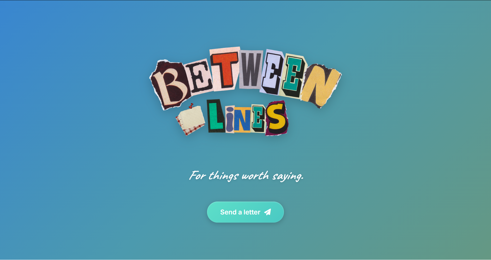
  
<b>Dashboard</b>

 

<table style="width:100%; text-align:center;">
  <tr>
    <td style="width:50%;">
      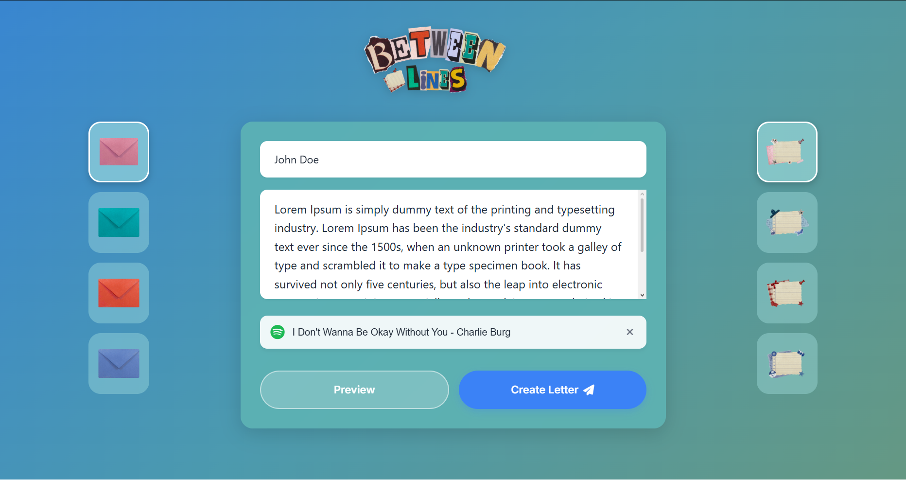
       
      <b>Letter Preview</b>
    </td>
    <td style="width:50%;">
      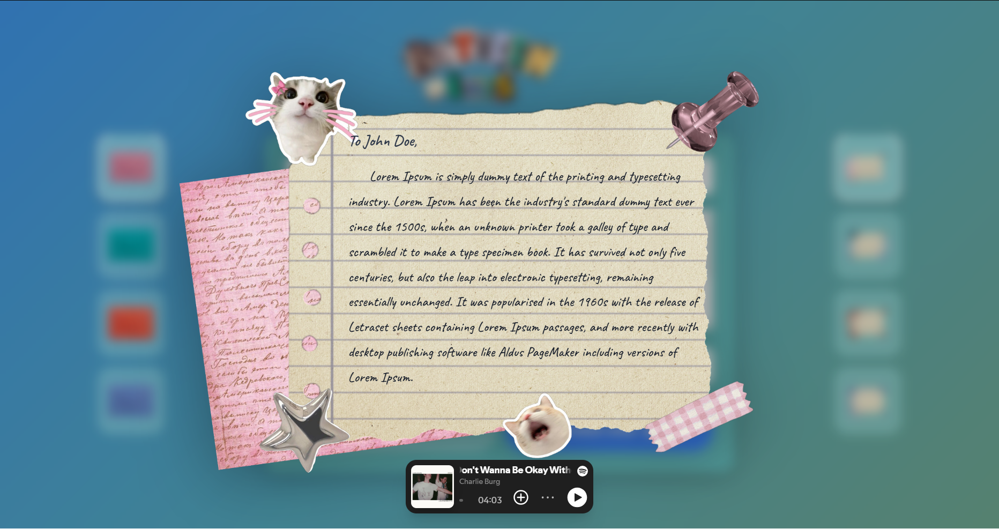
       
      <b>Writing Experience</b>
    </td>
  </tr>
  <tr>
    <td style="width:50%;">
      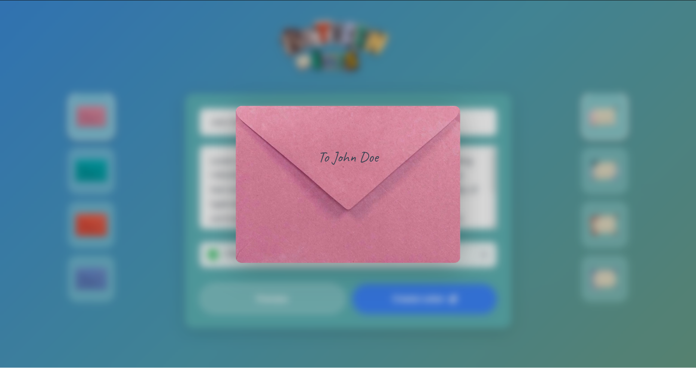
       
      <b>Envelope Selection</b>
    </td>
    <td style="width:50%;">
      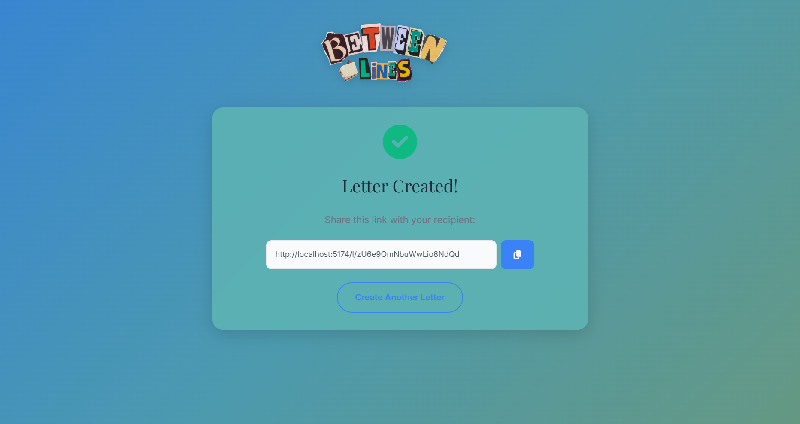
       
      <b>Opening Animation</b>
    </td>
  </tr>
  <tr>
    <td style="width:50%;">
      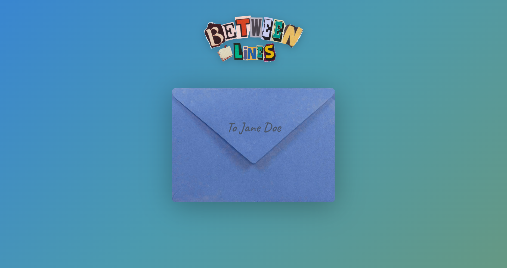
       
      <b>Theme Gallery</b>
    </td>
    <td style="width:50%;">
      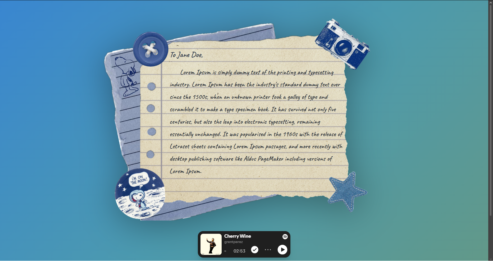
       
      <b>Responsive View</b>
    </td>
  </tr>
</table>

### Mobile Experience

<table style="width:100%; text-align:center;">
  <tr>
    <td style="width:33%;">
      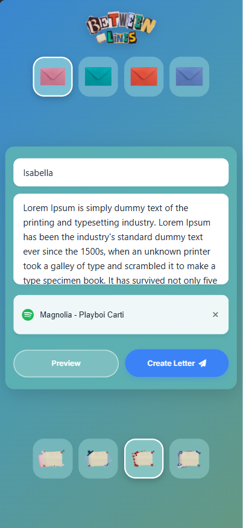
       
      <b>Dashboard</b>
    </td>
    <td style="width:33%;">
      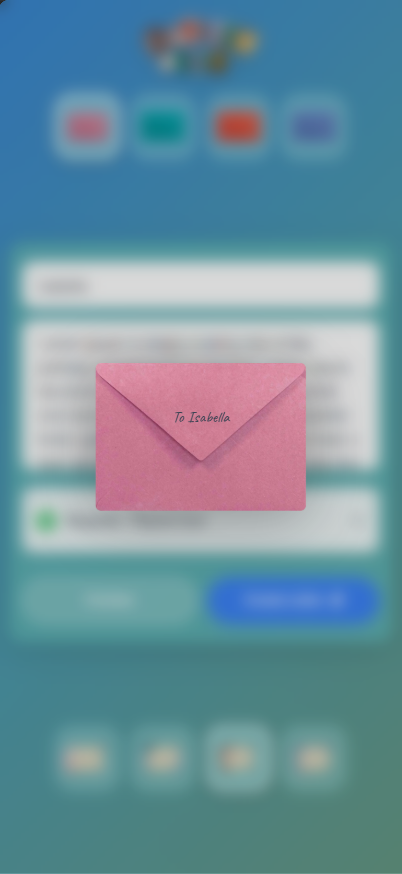
       
      <b>Preview</b>
    </td>
    <td style="width:33%;">
      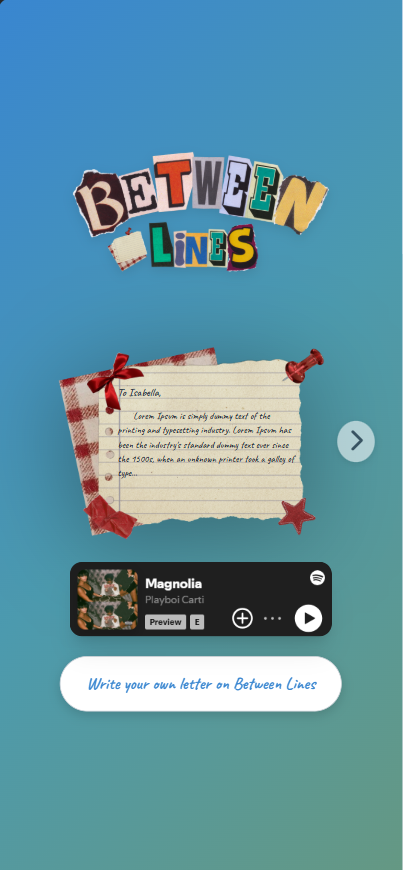
       
      <b>Letter View</b>
    </td>
  </tr>
</table>

## 📄 License

This project is open source and available under the [MIT License](LICENSE).